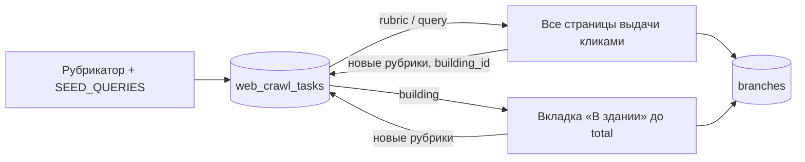

# Парсер 2ГИС → PostgreSQL (через браузер, без API-ключей)

Собирает все объекты городов Казахстана с 2gis.kz: организации, ЖК и отдельные дома, магазины и сервисы внутри ЖК, парки, площадки (баскетбольные, теннисные, детские, воркаут), достопримечательности, общественный транспорт и отзывы. Работает через реальный системный Chrome (Playwright), как `dgis_stations_parser.py`.

## Весь Казахстан (`kz`)

В 2ГИС Казахстан — это 19 проектов (городов). В каждый проект входят и населённые пункты-спутники: у Астаны — Косшы, Талапкер, Караоткель…, у Алматы — Талдыкорган, Конаев, Каскелен, Талгар…, у Шымкента — Ленгер, Арысь… Их объекты приходят в той же выдаче, что и объекты самого города. Список проектов, их `region_id` и спутники проверены на живом сайте (`CITIES` в `parser.py`).

Обход идёт волнами (`crawl_plan` в БД):

| Волна | Города |
|---|---|
| 1 — крупные города | Алматы, Астана, Шымкент (65–150 тыс. объектов) |
| 2 — областные центры | Караганда, Актау, Павлодар, Актобе, Костанай, Кокшетау, Атырау, Семей, Уральск, Усть-Каменогорск, Тараз, Кызылорда, Петропавловск |
| 3 — малые города | Туркестан, Экибастуз, Жезказган |
| 4 — добор | по всем городам: ещё попытки неполным задачам, карточкам и лентам отзывов |

Этапы каждого города: `transport` → `catalog` (рубрикатор, запросы, рубрики «снежным комом») → `buildings` («В здании») → `details` (полные карточки и отзывы: сначала сам город, потом спутники). Этап города начинается, только когда выполнены предыдущие.

```bash
python main.py kz                       # все волны по порядку
python main.py kz --tiers 1             # только крупные города
python main.py plan                     # что выполнено
python main.py stats                    # полнота: заявлено 2ГИС / собрано по каждому городу
```

- Капча или обрыв сети: этап откладывается (15 мин, 30, 60, далее каждые 2 ч), воркер ждёт и продолжает. Прогресс внутри этапа сохранён в очередях. На сервере без человека — `--captcha-wait 0`.
- Воркеров может быть несколько: план общий в БД, каждый берёт свой этап. Смысл есть только при разных IP (`--proxy`), иначе 2ГИС быстрее покажет капчу.
- Полнота сверяется со статистикой самого 2ГИС: у каждого проекта есть `statistics.branch_count`, `route_count`, `rubric_count` (таблица `regions`, витрина `v_city_completeness`).

## Как обеспечивается полнота

Проверено на живом 2gis.kz:

- **Выдача не обрезается.** Страница поиска сама сообщает `total` и `pages` (например, «магазин» в Астане — 4677 объектов на 390 страницах). Парсер проходит все страницы и записывает в `web_crawl_tasks` пару `total` (заявлено 2ГИС) / `collected` (собрано).
- **Листание только кликами.** Прямой переход на `/page/N` 2ГИС игнорирует и отдаёт первую страницу. Поэтому страницы листаются кликами, а данные берутся из XHR `/3.0/items`, который сайт сам запрашивает при клике.
- **Рубрики с фильтром `rubricId`.** В выдаче только объекты этой рубрики. Рубрики берутся из рубрикатора города и из карточек найденных объектов («снежный ком»): у каждого объекта есть рубрики, каждая найденная рубрика обходится целиком.
- **«В здании» у каждого здания.** Для каждого `building_id`, встреченного в карточках, открывается вкладка «В здании» и догружается кнопкой «Загрузить ещё» до `total`. Так собираются магазины, кафе и сервисы внутри ЖК и объекты на территории (например, в блоке C «Хайвил Астана» — 121 из 121).
- **Возобновляемость.** Очередь хранится в БД. После Ctrl+C, капчи или сбоя та же команда продолжает с места остановки. Неполные задачи (`incomplete`) повторяются до 3 раз.



## Полная карточка

Выдача поиска и «В здании» дают только краткие данные (без телефонов). Полная карточка берётся со страницы объекта (`/firm/{id}` или `/geo/{id}`): телефоны, email, сайты, Instagram, WhatsApp, Telegram и другие контакты попадают в `contacts`, а вся карточка целиком (атрибуты, график, фото, входы, парковки) — в `branches.raw`. Время сбора — `branches.card_synced_at`. Данные из поиска полную карточку не затирают.

Отзывы собираются до конца ленты. Страница `/tab/reviews` содержит и полную карточку, и первые 50 отзывов (`__REACT_QUERY_STATE__`) с `next_link` на следующую страницу. Остальные отзывы берутся по цепочке `next_link` из API отзывов, которым пользуется сам сайт. Если API не ответил, догрузка идёт кликами «Загрузить ещё» в браузере. Комментарии к отзывам (официальные ответы организаций и реплики) лежат в `review_comments`. Если у отзыва единственный комментарий — официальный ответ, он берётся из самого отзыва (тот же id и текст). Остальные запрашиваются по одному на отзыв, как это делает сайт.

## Скорость

Сервер 2ГИС отдаёт данные страницы (`initialState`) уже в HTML — обычному HTTP-клиенту, без кук и без браузера. Поэтому карточки, «В здании», маршруты, остановки, рубрикатор и выдача в одну страницу берутся HTTP-запросами (`fetcher.py`, httpx). Если вместо данных пришла капча, заглушка или ошибка, страница открывается в браузере, как раньше. Браузер кликами нужен только для листания многостраничной выдачи и для длинных списков «В здании», которых ещё нет в базе; Chrome запускается лениво — только когда он действительно понадобился.

- Карточки, отзывы и здания — параллельно (`--concurrency`, по умолчанию 3 запроса в полёте). Общий для всех потоков ограничитель частоты начинает с ~1 запроса в секунду, после каждых 200 успешных ответов ускоряется на 10% (до 2 в секунду), а при капче, 403 или 429 вдвое замедляется и делает паузу. Замер: 100 карточек — 101 с (было ~1,7–2 с на карточку), 60 объектов с отзывами и комментариями — 184 с, без браузера и без блокировок.
- Два воркера конвейером (`--stages`): `kz` с браузером идёт по транспорту и каталогу, `kz-http` без браузера — по «В здании», карточкам и отзывам. Пока `kz` листает каталог следующего города, `kz-http` дособирает предыдущий, а когда ждать нечего — собирает впрок карточки уже найденных объектов.

- «В здании»: если все объекты уместились на первой странице (≤12) или в базе уже есть не меньше заявленного числа объектов с этим `building_id`, вкладка в браузере не открывается. Полная карточка здания сохраняется с той же страницы.
- Карточка + отзывы объекта — один запрос вместо двух загрузок страницы.
- Паузы браузера: после загрузки страницы и клика — 1,5–2,6 с. Общий множитель для браузера и ограничителя HTTP — `--pace` / `DGIS_PACE`.

## Район целиком (`area`)

Сайт не показывает список всех объектов района. Внутренний запрос каталога по полигону подписан JS сайта и без подписи отвечает `key is blocked`, поэтому район собирается через интерфейс:

1. Карточка района (`/geo/{id}`): полигон границ и `statistics.building_count` — сколько зданий в районе по данным 2ГИС.
2. Скан карты: на 18-м зуме (≈0,37 м на пиксель, проверено калибровкой) внутри полигона прокликивается сетка с шагом ≈12 м. Каждый клик открывает объект под курсором: здание, организацию, площадку, остановку.
3. Полные карточки найденных объектов (из них берутся `building_id` организаций).
4. «В здании» у каждого здания района, до `total`.
5. Полные карточки всего найденного внутри зданий.
6. Отзывы и комментарии.

Итог в `web_crawl_tasks` (kind=`area`): `total` — зданий по данным 2ГИС, `collected` — найдено зданий в границах района.

## Антибан

- Видимое окно системного Chrome: headless-браузерам и IP дата-центров 2ГИС отдаёт reCAPTCHA.
- Один контекст (куки) на весь обход, пагинация кликами внутри SPA.
- Паузы 1,5–2,6 с после каждого действия. Каждые 150 действий — перерыв 25–50 с.
- При капче парсер ждёт до 120 с (`--captcha-wait`), пока её решат в окне браузера. Если капчу не решили, обход останавливается (в `kz` — этап откладывается), прогресс сохраняется, задача остаётся в очереди.
- `--proxies file.txt` / `--proxy URL`: прокси для браузерного контекста.

Полностью исключить блокировку нельзя: это решает 2ГИС. Полный обход крупного города — десятки тысяч кликов и много часов работы. IP дата-центров (облачные VPS) 2ГИС блокирует ещё до сайта. Запускайте с обычного IP (офис) или через резидентные прокси и не параллельте несколько экземпляров на одном IP.

## Сервер (Docker)

```bash
cp .env.example .env                 # PG_DSN, PG_SCHEMA; при необходимости DGIS_PROXY
docker compose build
docker compose run --rm parser init-db
docker compose up -d kz kz-http      # kz — браузер (Chrome на виртуальном дисплее Xvfb), kz-http — без браузера
docker compose logs -f kz kz-http
docker compose run --rm parser plan  # прогресс по волнам
```

## Установка

```bash
pip install -r requirements.txt   # playwright install не нужен — системный Chrome
cp .env.example .env              # PG_DSN, PG_SCHEMA
python main.py init-db
```

## Команды

```bash
# Один район целиком (тест перед всем городом)
python main.py area -r Астана --area "микрорайон 4"   # или ID района из URL 2ГИС: --area 9570810633125902

# Все объекты Астаны: рубрикатор + площадки/ЖК/парки + всё «В здании»
python main.py catalog -r Астана

# Полные карточки (контакты, соцсети) для уже найденных объектов города
python main.py cards -r Астана

# Транспорт: остановки, маршруты, связки маршрут × остановка (+ CSV в ./output)
python main.py transport -r Астана

# Транспорт + каталог
python main.py crawl -r Астана

# Отзывы и комментарии к ним для сохранённых объектов (крупные первыми, до конца ленты)
python main.py reviews -r Астана

# Объём данных, категории и полнота: заявлено 2ГИС / собрано по каждому типу задач
python main.py stats -r Астана
```

Полезные флаги `catalog`/`crawl`:

| Флаг | Что делает |
|---|---|
| `-q "кофейня" -q "ЖК"` | обойти только эти запросы вместо рубрикатора и `SEED_QUERIES` |
| `--no-expand` | не добавлять в очередь рубрики и здания из найденных карточек |
| `--no-buildings` | не обходить вкладку «В здании» |
| `--max-tasks N` | остановиться после N задач (для пробного запуска) |
| `--fresh` | очистить очередь города и начать заново |
| `--headless` | скрыть окно браузера (капча чаще) |

## Таблицы (схема `twogis`)

У всех таблиц и колонок есть русские комментарии (`COMMENT ON`), они видны в DBeaver/pgAdmin и в `\d+`.

| Таблица / view | Что хранит |
|---|---|
| `branches` | все объекты: организации, здания/ЖК, площадки, территории; `primary_rubric` и `rubrics[]` — категории |
| `organizations` | сети/юрлица, объединяющие филиалы |
| `rubrics`, `branch_rubrics` | рубрикатор и связь объект ↔ рубрика |
| `contacts` | телефоны, email, сайты, Instagram, WhatsApp, Telegram… (из полных карточек) |
| `reviews` | отзывы: оценка, текст, автор, фото, лайки |
| `review_comments` | комментарии к отзывам: официальные ответы организаций и реплики пользователей |
| `transport_stops`, `transport_routes`, `transport_route_stops` | остановки, маршруты, связки маршрут × остановка |
| `transport_route_platforms` | остановки каждого маршрута по порядку, отдельно по направлениям (со страницы `/route/{id}`) |
| `web_crawl_tasks` | очередь обхода и журнал полноты (`total` / `collected` по запросу, рубрике, зданию, району) |
| `regions` | проекты 2ГИС: границы, спутники, `statistics` — сколько объектов, маршрутов и рубрик в городе по данным 2ГИС |
| `crawl_plan` | план `kz`: город × этап, волна, статус, воркер, причина остановки |
| `v_city_completeness` | **полнота по городам**: заявлено 2ГИС / собрано объектов и маршрутов, доля полных карточек и лент отзывов, открытые и неполные задачи |
| `v_objects` | **карточка объекта одной строкой**: категория, организация, адрес, населённый пункт/район/микрорайон, здание, рейтинг, телефоны, WhatsApp, Telegram, Instagram, сайты, email (остальное в `all_contacts`), график текстом, атрибуты, число фото, ссылка на 2ГИС |
| `v_object_reviews` | отзыв + объект + комментарии (ответы организации, реплики) в JSON |
| `v_buildings` | здание/ЖК и список всего, что внутри, с категорией, этажом и телефонами |
| `v_all_objects` | единый реестр объектов и остановок с категорией и местом: `region`, `district_area`, `locality` (населённый пункт), `microdistrict` |
| `v_routes` | маршрут одной строкой на направление: `route_type_ru` (Автобус, Маршрутка, LRT, Электричка…), число остановок, `stops` — JSON-список `{n, stop, locality, district, …}` по порядку, `stops_text` — «1. …, 2. …», `localities` |
| `v_route_stops_ordered` | маршрут → остановки по порядку → населённый пункт, район, микрорайон каждой |
| `v_transport_stops` | остановки с населённым пунктом, районом города и микрорайоном |
| `v_branches`, `v_2gis_bus_stations` | плоские витрины |

Проверка полноты:

```sql
SELECT * FROM twogis.v_city_completeness;

SELECT kind, status, count(*), sum(total) AS заявлено, sum(collected) AS собрано
FROM twogis.web_crawl_tasks WHERE city_slug = 'astana' GROUP BY 1, 2;

-- что собрано не полностью
SELECT kind, label, total, collected, pages_done, pages_total, last_error
FROM twogis.web_crawl_tasks WHERE status <> 'done';
```
