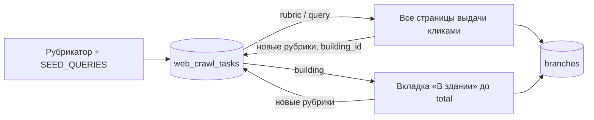

# Парсер 2ГИС → PostgreSQL (через браузер, без API-ключей)

Собирает все объекты города с 2gis.kz: организации, ЖК и отдельные дома, магазины и сервисы внутри ЖК, парки, площадки (баскетбольные, теннисные, детские, воркаут), достопримечательности, общественный транспорт и отзывы. Работает через реальный системный Chrome (Playwright), как `dgis_stations_parser.py`.

## Как обеспечивается полнота

Проверено на живом 2gis.kz:

- **Выдача не обрезается.** Страница поиска сама сообщает `total` и `pages` (например, «магазин» в Астане — 4677 объектов на 390 страницах). Парсер проходит все страницы и записывает в `web_crawl_tasks` пару `total` (заявлено 2ГИС) / `collected` (собрано).
- **Листание только кликами.** Прямой переход на `/page/N` 2ГИС игнорирует и отдаёт первую страницу. Поэтому страницы листаются кликами, а данные берутся из XHR `/3.0/items`, который сайт сам запрашивает при клике.
- **Рубрики с фильтром `rubricId`.** В выдаче только объекты этой рубрики. Рубрики берутся из рубрикатора города и из карточек найденных объектов («снежный ком»): у каждого объекта есть рубрики, каждая найденная рубрика обходится целиком.
- **«В здании» у каждого здания.** Для каждого `building_id`, встреченного в карточках, открывается вкладка «В здании» и догружается кнопкой «Загрузить ещё» до `total`. Так собираются магазины, кафе и сервисы внутри ЖК и объекты на территории (например, в блоке C «Хайвил Астана» — 121 из 121).
- **Возобновляемость.** Очередь хранится в БД. После Ctrl+C, капчи или сбоя та же команда продолжает с места остановки. Неполные задачи (`incomplete`) повторяются до 3 раз.



## Полная карточка

Выдача поиска и «В здании» дают только краткие данные (без телефонов). Полная карточка берётся со страницы объекта (`/firm/{id}` или `/geo/{id}`): телефоны, email, сайты, Instagram, WhatsApp, Telegram и другие контакты попадают в `contacts`, а вся карточка целиком (атрибуты, график, фото, входы, парковки) — в `branches.raw`. Время сбора — `branches.card_synced_at`. Данные из поиска полную карточку не затирают.

Отзывы собираются до конца ленты: первые 50 встроены в страницу (`__REACT_QUERY_STATE__`), остальные догружаются «Загрузить ещё». Комментарии к отзывам (официальные ответы организаций и реплики) лежат в `review_comments`.

## Район целиком (`area`)

Сайт не показывает список всех объектов района. Внутренний запрос каталога по полигону подписан JS сайта и без подписи отвечает `key is blocked`, поэтому район собирается через интерфейс:

1. Карточка района (`/geo/{id}`): полигон границ и `statistics.building_count` — сколько зданий в районе по данным 2ГИС.
2. Скан карты: на 18-м зуме (≈0,37 м на пиксель, проверено калибровкой) внутри полигона прокликивается сетка с шагом ≈12 м. Каждый клик открывает объект под курсором: здание, организацию, площадку, остановку.
3. Полные карточки найденных объектов (из них берутся `building_id` организаций).
4. «В здании» у каждого здания района, до `total`.
5. Полные карточки всего найденного внутри зданий.
6. Отзывы и комментарии.

Итог в `web_crawl_tasks` (kind=`area`): `total` — зданий по данным 2ГИС, `collected` — найдено зданий в границах района.

## Антибан

- Видимое окно системного Chrome: headless-браузерам и IP дата-центров 2ГИС отдаёт reCAPTCHA.
- Один контекст (куки) на весь обход, пагинация кликами внутри SPA.
- Паузы 1,5–2,6 с после каждого действия. Каждые 150 действий — перерыв 25–50 с.
- При капче парсер ждёт до 120 с, пока её решат в окне браузера. Если капчу не решили, обход останавливается, прогресс сохраняется, задача остаётся в очереди.
- `--proxies file.txt` / `--proxy URL`: прокси для браузерного контекста.

Полностью исключить блокировку нельзя: это решает 2ГИС. Полный обход крупного города — десятки тысяч кликов и много часов работы. Запускайте с обычного (не серверного) IP и не параллельте несколько экземпляров на одном IP.

## Установка

```bash
pip install -r requirements.txt   # playwright install не нужен — системный Chrome
cp .env.example .env              # PG_DSN, PG_SCHEMA
python main.py init-db
```

## Команды

```bash
# Один район целиком (тест перед всем городом)
python main.py area -r Астана --area "микрорайон 4"   # или ID района из URL 2ГИС: --area 9570810633125902

# Все объекты Астаны: рубрикатор + площадки/ЖК/парки + всё «В здании»
python main.py catalog -r Астана

# Полные карточки (контакты, соцсети) для уже найденных объектов города
python main.py cards -r Астана

# Транспорт: остановки, маршруты, связки маршрут × остановка (+ CSV в ./output)
python main.py transport -r Астана

# Транспорт + каталог
python main.py crawl -r Астана

# Отзывы и комментарии к ним для сохранённых объектов (крупные первыми, до конца ленты)
python main.py reviews -r Астана

# Объём данных, категории и полнота: заявлено 2ГИС / собрано по каждому типу задач
python main.py stats -r Астана
```

Полезные флаги `catalog`/`crawl`:

| Флаг | Что делает |
|---|---|
| `-q "кофейня" -q "ЖК"` | обойти только эти запросы вместо рубрикатора и `SEED_QUERIES` |
| `--no-expand` | не добавлять в очередь рубрики и здания из найденных карточек |
| `--no-buildings` | не обходить вкладку «В здании» |
| `--max-tasks N` | остановиться после N задач (для пробного запуска) |
| `--fresh` | очистить очередь города и начать заново |
| `--headless` | скрыть окно браузера (капча чаще) |

## Таблицы (схема `twogis`)

У всех таблиц и колонок есть русские комментарии (`COMMENT ON`), они видны в DBeaver/pgAdmin и в `\d+`.

| Таблица / view | Что хранит |
|---|---|
| `branches` | все объекты: организации, здания/ЖК, площадки, территории; `primary_rubric` и `rubrics[]` — категории |
| `organizations` | сети/юрлица, объединяющие филиалы |
| `rubrics`, `branch_rubrics` | рубрикатор и связь объект ↔ рубрика |
| `contacts` | телефоны, email, сайты, Instagram, WhatsApp, Telegram… (из полных карточек) |
| `reviews` | отзывы: оценка, текст, автор, фото, лайки |
| `review_comments` | комментарии к отзывам: официальные ответы организаций и реплики пользователей |
| `transport_stops`, `transport_routes`, `transport_route_stops` | остановки, маршруты, связки маршрут × остановка |
| `transport_route_platforms` | остановки каждого маршрута по порядку, отдельно по направлениям (со страницы `/route/{id}`) |
| `web_crawl_tasks` | очередь обхода и журнал полноты (`total` / `collected` по запросу, рубрике, зданию, району) |
| `v_all_objects` | единый реестр объектов и остановок с категорией |
| `v_branches`, `v_2gis_bus_stations` | плоские витрины |

Проверка полноты:

```sql
SELECT kind, status, count(*), sum(total) AS заявлено, sum(collected) AS собрано
FROM twogis.web_crawl_tasks WHERE city_slug = 'astana' GROUP BY 1, 2;

-- что собрано не полностью
SELECT kind, label, total, collected, pages_done, pages_total, last_error
FROM twogis.web_crawl_tasks WHERE status <> 'done';
```
